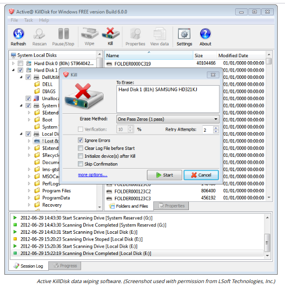

# DATA SANITIZATION TOOLS

#### DATA SANITIZATION TOOLS

Files deleted from a magnetic-type hard disk are not erased. Rather, the sectors are marked as available for writing and the data they contain will only be removed as new files are added. Similarly, using the standard Windows format tool will only remove references to files and mark all sectors as usable.

The standard method of sanitizing an HDD is called overwriting. This can be performed using the drive's firmware tools or a utility program. The most basic type of overwriting is called zero filling, which just sets each bit to zero. Single pass zero filling can leave patterns that can be read with specialist tools. A more secure method is to overwrite the content with one pass of all zeros, then a pass of all ones, and then a third pass in a pseudorandom pattern. Some secret service agencies require more than three passes. Overwriting can take a considerable amount of time to complete, depending on the number of passes.

> _Examples of tools supporting secure file or disk erasing include Sdelete (part of Sysinternals https://docs.microsoft.com/sysinternals) and Darik's Boot and Nuke (https://dban.org), plus the Active KillDisk suite shown here._

**Secure Erase (SE)**  
Since 2001, the SATA and Serial Attached SCSI (SAS) specifications have included a **Secure Erase (SE)** command. This command can be invoked using a drive/array utility or the hdparm Linux utility. On HDDs, this performs a single pass of **zero-filling**.

For SSDs and hybrid drives and some USB thumb drives and flash memory cards, overwriting methods are not reliable, because the device uses wear-leveling routines in the drive controller to communicate which locations are available for use to any software process accessing the device.

On SSDs, the SE command marks all blocks as empty. A block is the smallest unit on flash media that can be given an erase command. The drive firmware's automatic garbage collectors then perform the actual erase of each block over time. If this process is not completed (and there is no progress indicator), there is a risk of remnant recovery, though this requires removing the chips from the device to analyze them in specialist hardware.

**Instant Secure Erase (ISE)**  
HDDs and SSDs that are self-encrypting drives (SEDs) support another option, invoking a SANITIZE command set in SATA and SAS standards from 2012 to perform a **crypto erase**. Drive vendors implement this as Instant Secure Erase (ISE). With an SED, all data on the drive is encrypted using a media encryption key. When the erase command is issued, the MEK is erased, rendering the data unrecoverable. FIPS140-2 or FIPS140-3 validation provides assurance that the cryptographic implementation is strong.

> _If the device firmware does not support encryption, using a software disk encryption product and then destroying the key and using SE should be sufficient for most confidentiality requirements._